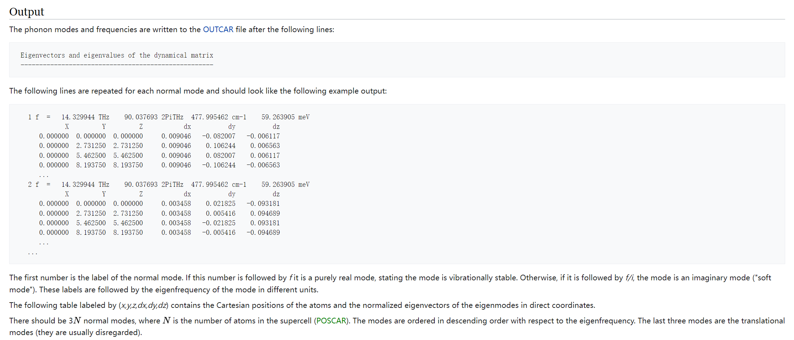

# vibration-plot-mode-in-vesta-2

## Abstract

This is an updated version of [vibration-plot-mode-in-vesta](https://github.com/faradaymahe/vibration-plot-mode-in-vesta) code. The main function is the same as older version, which is to automatically convert the vibration modes at **Γ point** calculated by other software to Vesta format file to visualize it. The improvements include:

- Simplify operating procedures and make it more automated: No more manual generation of initial Vesta files.
- More complete information: Beside the vibration modes in vesta file, other information such as vibration frequency, atoms cartesian coordinate etc is also exported to a csv file.
- **Supports converting results from more calculation software: Not only the results of vasp calculation, the calculation results of phonopy is also supported.**

## Usage

### **1.** Generate VESTA mode files from VASP calculation

<u><big>a.  Perform phonons calculation in vasp</big></u>

There are two methods to calculate phonons at Γ point in vasp. The first is [finite differences](https://www.vasp.at/wiki/index.php/Phonons_from_finite_differences).For [finite differences](https://www.vasp.at/wiki/index.php/Phonons_from_finite_differences) calculation, **IBRION** should be set 5 or 6, **NSW=1**, and **ISIF**, **POTIM**, **NFREE** should be set carefully.

The second method is [density-functional-perturbation theory](https://www.vasp.at/wiki/index.php/Phonons_from_density-functional-perturbation_theory), For [density-functional-perturbation theory](https://www.vasp.at/wiki/index.php/Phonons_from_density-functional-perturbation_theory) calculation, **IBRION** should be set 7 or 8, **NSW=1**.

After this step, you can get the **OUTCAR** from the calculation. Also, the input file **POSCAR** is alos needed for next step.

#### **b**.  Run python script
With **POSCAR** file and **OUTCAR** file from previous step, now run command 
```bash
python vasp_modes_to_vesta.py
```
and you can get the result.

The dependent libraries necessary for running of the python script is:
- [numpy](https://numpy.org/)
- [pandas](https://pandas.pydata.org/)
- [pymatgen](https://pymatgen.org/)
- sys, os, re

The parameters that need to be set in the python script are:
```python
dir_out_file = 'out'                                        # The directory for saving result file   
scaling_factor = 3                                          # The scale factor of the length of vector in VESTA file     
poscar_filename = './POSCAR'                                # The full path of POSCAR for VASP frequency calculation
outcar_filename = './OUTCAR'                                # The full path of OUTCAR generated in VASP frequency calculation
cmd_vesta_path = 'D:\VESTA-win64\VESTA-win64\VESTA.exe'     # The full path of VESTA command
```

### **2.** Generate VESTA mode files from Phonopy calculation

#### **a**.  Perform force sets calculation in phonopy

Since phonopy itself cannot perform DFT calculation, this step requires the use of DFT software. vasp, quantum-espresso, abinit, etc. are all ok. Here is the referencce:
- vasp: [https://phonopy.github.io/phonopy/vasp.html#vasp-interface](https://phonopy.github.io/phonopy/vasp.html#vasp-interface)
- qe: [https://phonopy.github.io/phonopy/qe.html](https://phonopy.github.io/phonopy/qe.html)
- cp2k: [https://phonopy.github.io/phonopy/cp2k.html](https://phonopy.github.io/phonopy/cp2k.html)
- ...

Before calculating force sets, the input parameters of **supercell_matrix** and initial unitcell are also needed for next step, together with the force sets file generated in this step.

#### **b**.  Run python script
With **unitcell** file , **force sets** file and **supercell_matrix** from previous step, now run command 
```bash
python phonopy_modes_to_vesta.py
```
and you can get the result.

The dependent libraries necessary for running of the python script is:
- [numpy](https://numpy.org/)
- [pandas](https://pandas.pydata.org/)
- [pymatgen](https://pymatgen.org/)
- [phonopy](https://phonopy.github.io/phonopy/#)
- sys, os

The parameters that need to be set in the python script are:
```python
dir_out_file = 'out'                                        # The directory for saving result file  
scaling_factor = 3                                          # The scale factor of the length of vector in VESTA file             
supercell_matrix = [4, 4, 1]                                # The supercell matrix used for force sets calculation
unitcell_filename = './CONTCAR'                             # The unit cell used for force sets calculation
force_sets_filename = './FORCE_SETS'                        # The force sets file path calculated by Phonopy
cmd_vesta_path = 'D:\VESTA-win64\VESTA-win64\VESTA.exe'     # The full path of VESTA command
```

## Tips

### **1.**  How to read phonons calculation results from OUTCAR file



> [https://www.vasp.at/wiki/index.php/Phonons_from_finite_differences](https://www.vasp.at/wiki/index.php/Phonons_from_finite_differences)

### **2.**  How to read eigvectors from phonopy calculation

<section id="general">
<h4>General<a class="headerlink" href="#general" title="Permalink to this heading">#</a></h4>
<table class="table">
<colgroup>
<col style="width: 20.0%">
<col style="width: 80.0%">
</colgroup>
<thead>
<tr class="row-odd"><th class="head"><p>Key</p></th>
<th class="head"><p>Description</p></th>
</tr>
</thead>
<tbody>
<tr class="row-even"><td><p>nqpoint</p></td>
<td><p>Number of q-points calculated.</p></td>
</tr>
<tr class="row-odd"><td><p>natom</p></td>
<td><p>Number of atoms in the primitive cell.</p></td>
</tr>
<tr class="row-even"><td><p>phonon</p></td>
<td><p>Key name of list for q-points.</p></td>
</tr>
<tr class="row-odd"><td><p>q-position</p></td>
<td><p>Position of q-vector in reduced coordinates.</p></td>
</tr>
<tr class="row-even"><td><p>band</p></td>
<td><p>Key name of list for bands.</p></td>
</tr>
<tr class="row-odd"><td><p>frequency</p></td>
<td><p>Phonon frequency in a specified unit at each phonon mode</p></td>
</tr>
<tr class="row-even"><td><p>eigenvector</p></td>
<td><p>Eigenvector at each phonon mode.
Each eigenvector :math:<code class="docutils literal notranslate"><span class="pre">\mathbf{e}</span></code> of
<a class="reference internal" href="formulation.html#dynacmial-matrix-theory"><span class="std std-ref">dynamical matrix</span></a>
is shown as sets of three
complex values of each atom along the Cartesian axes in
the primitive cell. The real and imaginary values
correspond to the left and right, respectively.
A set of eigenvectors comprising all bands at a q-point
forms a unitary matrix obtained as the result of
numpy.linalg.eigh, i.e., LAPACK of routine _heevd.
Therefore eigenvectors correspond to the column vectors
of the unitary matrix.</p></td>
</tr>
<tr class="row-odd"><td><p>group_velocity</p></td>
<td><p>Group velocity at each phonon mode in the
Cartesian coordinates defined in the unit cell.</p></td>
</tr>
</tbody>
</table>
</section>

> [https://phonopy.github.io/phonopy/output-files.html#general](https://phonopy.github.io/phonopy/output-files.html#general)

The form of eigenvector output by phonopy

|  | Band #1 | Band #2 | ... | Band #3N|
| :---: | :---: | :---: | :---: | :---: | 
| Atom #1 | Eig_X | Eig_X | ... | Eig_X |
| Atom #1 | Eig_Y | Eig_Y | ... | Eig_Y |
| Atom #1 | Eig_Z | Eig_Z | ... | Eig_Z |
| ... | ... | ... | ... | ... |
| Atom #N | Eig_X | Eig_X | ... | Eig_X |
| Atom #N | Eig_Y | Eig_Y | ... | Eig_Y |
| Atom #N | Eig_Z | Eig_Z | ... | Eig_Z |
